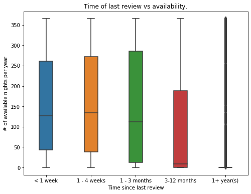
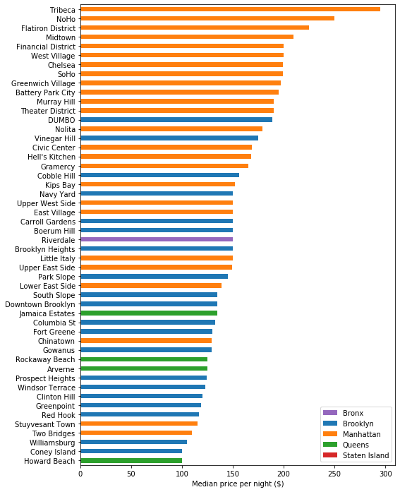
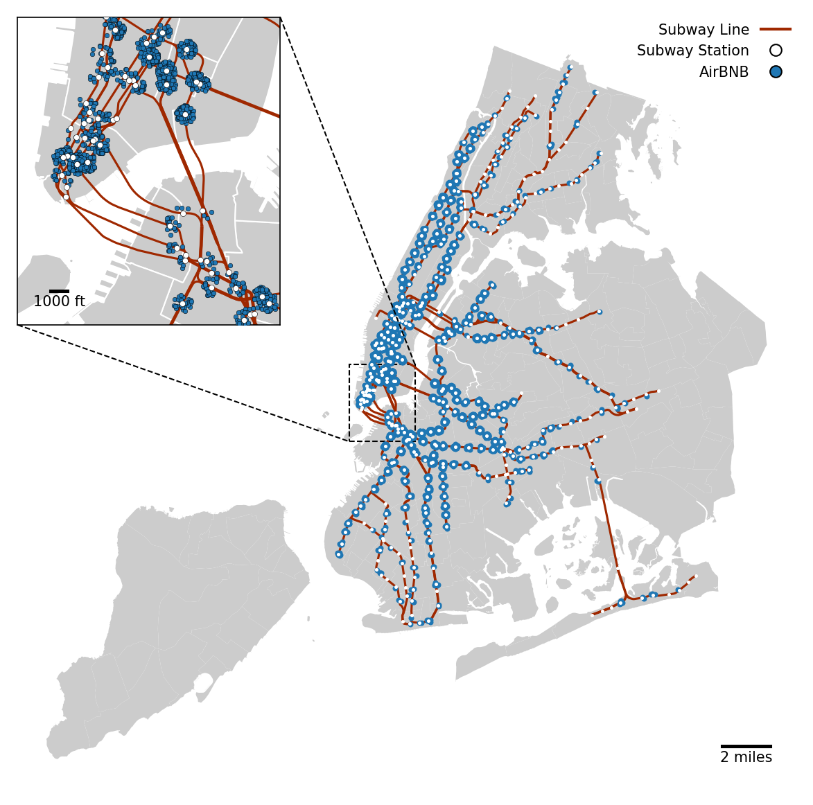
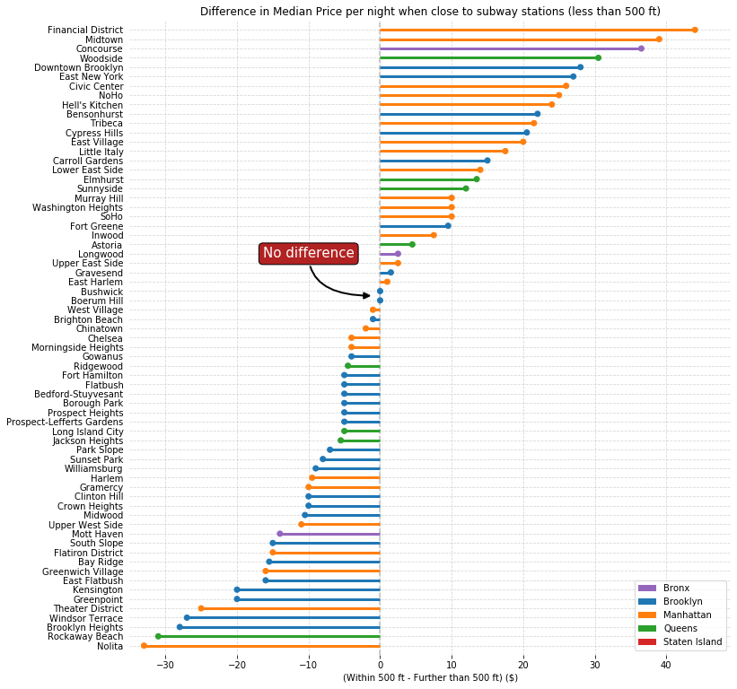
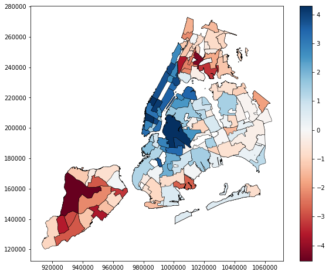

# Analysing AirBNB data from 2019 for NYC

The full analysis I've conducted can be found in the jupyter notebook located here: **[airbnb_2019_ny.ipynb](airbnb_2019_ny.ipynb)**.

Data originally downloaded from here: https://www.kaggle.com/dgomonov/new-york-city-airbnb-open-data

This is a bit of a meandering 'stream of consciousness' analysis of AirBNB listings within NYC as of 2019. 

In the first section, I've imported and cleaned the data, identifying outliers, missing data and any interesting observations which may be worth chasing up. For example, an examination of the time since last review vs the number of available nights to rent suggest there are many dormant listings in this dataset. Perhaps we would want to remove these from our analysis? I could imagine these datapoints may skew our interpretation of AirBNB listings...

In the second section (and partly during data cleaning), I've performed some preliminary exploratory data analysis. For instance, neighbourhoods in manhatten demand the highest price/night:

In part three, I did some geospatial analysis. 

I firstly imported the locations of subway stations and partitioned the data into listings which were within 500 ft of a subway station and those which weren't:

This allowed me to explore whether there was any relationship between the price per night and proximity to subway stations. On average, listings within 500 ft of a subway station charged approximately $22 more per night than those further afield. However, there was variability between neighbourhoods:

 

Finally, I looked at which neighbourhoods are over- or under-represented on AirBNB by combining population data with the AirBNB data (blue = over-representation and red = under-representation):

## TODO
* Look at other buffers around stations.
    - Is there a better way? Instead of an arbitrary buffer can we find raw distances from station to house?
        - use that as a predictor for cost?
* Dig into the descriptions.
    - What are the popular descriptors used by hosts?
    - Can they be used to predict popularity (# of reviews as proxy)?
    - Predict how much they charge?
* Build some sort of recommendation system incorporating my subway station data which let's me find places close to public transport.
* Can we build a model to predict price?
    - From looking on kaggle people have tried but IMO their data cleaning is poor. For instance, there are many properties listed which are likely inactive which many have not removed.
